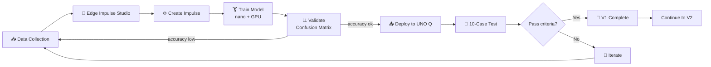
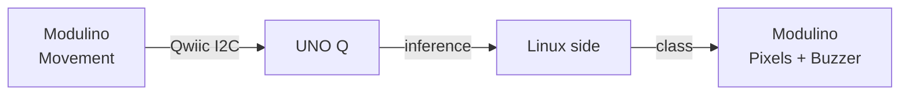
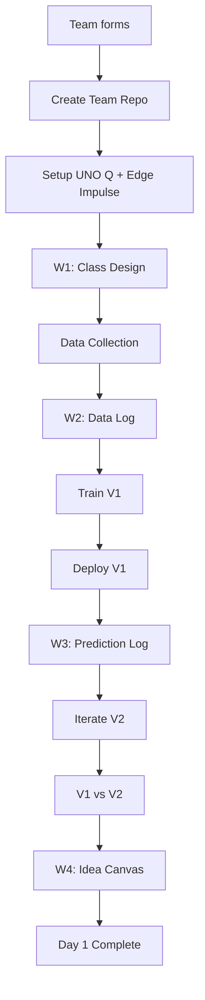
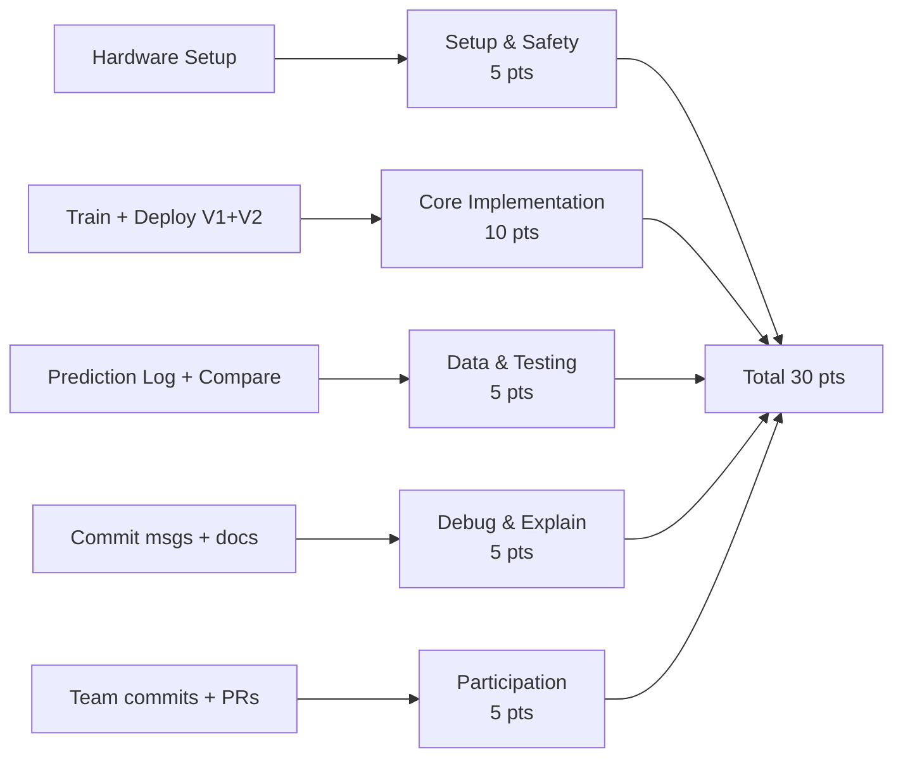

<!-- workshop-header -->

# Edge AI Pipeline Diagram

> Reference diagram สำหรับ slide / docs

## Full Pipeline

## Hardware Flow (Track A)

## Team Workflow

## Skill Assessment Mapping

---

**Note:** GitHub renders Mermaid natively — ไฟล์นี้แสดงเป็น diagram บน GitHub
