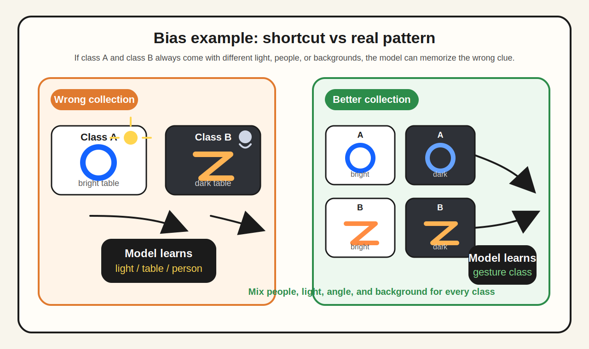
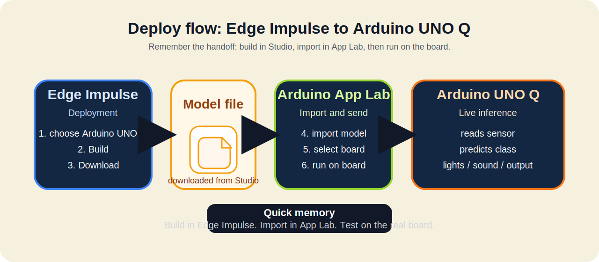

<!-- workshop-header -->


# 🎨 Day 1 Teaching Slides


## 📑 Section 1: Opening — 09:00-09:15

**Coding Thailand 2026 — Edge AI Workshop**
*Arduino UNO Q × Modulino × Edge Impulse*


- Mentor: ผศ.ดร.สัญชัย เอียดปราบ
- วิศวกรรมระบบสมองกลฝังตัวและอิเล็กทรอนิกส์สื่อสาร
- คณะวิศวกรรมศาสตร์ มหาวิทยาลัยบูรพา
- วันที่ 28 พฤษภาคม 2569

---

### Welcome & House Rules

```
Welcome! 🎉

📋 กฎ:
1. มีคำถาม → ยกมือ ไม่ต้องรอ
2. ทำงานเป็นทีม — ไม่ใช่แข่งกันคนเดียว
3. ใช้เครื่องมือสมัยใหม่ — Git, Edge Impulse, AI helpers ได้ แต่อ้างอิงให้ชัด
4. ตั้งใจตลอด → 30 คะแนนรออยู่
```

---

### เกริ่นก่อนเริ่ม: งานแข่งนี้เดินยังไง

```
ภาพรวม 3 วัน:

Day 1 → สร้างฐานให้แน่น
        setup, เก็บ data, train, deploy, test

Day 2 → ต่อยอดเป็น prototype
        เพิ่ม use case, ความเสถียร, และการใช้งานจริง

Day 3 → demo + pitch
        อธิบายโจทย์ วิธีทำ ผลทดสอบ และข้อจำกัด

ดังนั้นวันนี้ต้องได้ทั้ง "ของที่รันได้"
และ "หลักฐานที่เอาไปเล่าต่อได้"
```

---

### What is Edge AI?

```
Cloud AI 🌥️        →    Edge AI ⚡
─────────────       ─────────────
ส่งข้อมูลขึ้น cloud     ทำงานบนอุปกรณ์เลย
ช้า ต้องมีเน็ต          เร็ว ไม่ต้องเน็ต
แพง บน scale          ราคาถูก
Privacy?               Privacy ✓
```

ตัวอย่าง: Smart camera, Voice assistant, Fall detector, Quality control

---

### Why Arduino UNO Q?

```
UNO Q = สองสมองในบอร์ดเดียว

🧠 MCU side: real-time I/O (Modulino)
🐧 Linux side: รัน ML model ใหญ่ๆ ได้

→ ต่างจาก Arduino ทั่วไป
→ Powered by Qualcomm Dragonwing
→ ใช้ Linux side ตอน setup / connect / ทำงานกับ Edge Impulse
→ ใช้ MCU side ตอนอ่าน sensor และคุม output แบบทันที
```

<a href="https://www.arduino.cc/product-uno-q/">
        
</a>


---

### Modulino — Plug & Play

```
🔌 Qwiic connector — เสียบแล้วใช้ได้เลย
🚫 ไม่ต้องบัดกรี
🔗 Daisy-chain — ต่อกันเป็นสาย

11 modules ให้เลือก:
Sensors: Movement, Distance, Thermo, Light
Inputs: Buttons, Knob, Joystick
Outputs: Pixels, Buzzer, LED Matrix, Vibro
```

<a href="https://store.arduino.cc/pages/modulino">
        
</a>
<a href="https://store.arduino.cc/pages/modulino">
        
</a>

---

### Edge Impulse — The ML Platform

```
Pipeline ใน 4 ขั้นตอน:

1. 📥 Collect    — เก็บข้อมูลจาก sensor
2. 🧠 Design     — เลือก algorithm
3. 🏋️ Train     — สอน model
4. 📤 Deploy    — ใส่ลง UNO Q

ทำผ่าน web — ฟรี (free tier)
```

<a href="https://www.edgeimpulse.com/product">
        
</a>

---

### Pipeline ที่ใช้ทำงาน และใช้เล่าในงานแข่ง

```
เวลาทำงานทั้งวัน ให้มองผ่าน 6 ขั้นนี้:

1. Capture   → อ่าน sensor / input
2. Prepare   → แบ่ง class + เก็บ data
3. Model     → create impulse + train
4. Inference → รันบน UNO Q
5. Output    → ไฟ / เสียง / การตอบสนอง
6. Evaluate  → test, log, แล้ววนแก้

กรรมการไม่ได้ดูแค่ accuracy
แต่ดูว่าทีมอธิบาย pipeline นี้ได้ครบไหม
```

---

### Day 1 ต้องได้อะไรไปต่อในงานแข่ง

```
จบวันนี้ ทีมควรถือของกลับไป 5 อย่าง:

✅ AI model V1 + V2 (improved)
✅ Deploy บน UNO Q ทำงานจริง
✅ Prediction Log อย่างน้อย 10 cases
✅ GitHub repo ที่มีหลักฐานการทำงาน
✅ Idea Canvas สำหรับต่อยอด Day 2
```

---

### 30-Point Skill Assessment

```
Day 1 = 30 คะแนน / 100 ทั้งโครงการ

ประเมินตลอดวัน โดยดูจากหลักฐานจริง:
GitHub history, การ deploy, log การทดสอบ, และการอธิบายงาน

Setup & Safety              5 pts
Core Implementation        10 pts  ★ มากสุด
Data & Testing              5 pts
Debug & Explain             5 pts
Participation               5 pts
─────────────────────────
Total                      30 pts
```

⚠️ ย้ำว่า process > result

---

## 📑 Section 2: Anchor Demo — 09:15-09:30

### ลองทำ "Gesture Wand" เพื่อรู้จัก Impulse

```
🪄 โจทย์: จำแนกท่าทางมือแบบง่ายที่สุด

ช่วงนี้พาดู 3 เรื่องพร้อมกัน:
1. เก็บ data เข้าโปรเจกต์
2. สร้าง Impulse
3. Train แล้ว deploy กลับลงบอร์ด

Impulse = ชุดคำสั่งที่บอกว่า
ข้อมูลจะถูกประมวลผลยังไง
และจะส่งเข้า learning block แบบไหน

Classes:
○ วงกลม (Circle)
○ Z-shape
○ นิ่ง (Still)

Sensor: Modulino Movement (IMU)
Output: Modulino Pixels (สีตามคลาส)
```

พาเปิด live demo แล้วชี้ให้เห็นว่า data, impulse, model อยู่ตรงไหนใน Studio

---

### พาทำทีละขั้นใน Edge Impulse

```
1. ต่อ Modulino Movement → UNO Q (Qwiic)
2. เปิด Edge Impulse Studio
3. Connect device
4. Record: 20 samples × 3 classes
5. Create Impulse → เลือก processing + Classification
6. Generate features
7. Train (NN classifier, nano)
8. Build → Deploy to UNO Q → ทดลอง inference 🎉
```

---

### Pipeline Summary

```
ไม่ว่า track ไหน — Pipeline เดียวกัน:

┌─────────┐    ┌──────────┐    ┌────────┐    ┌─────────┐
│ Collect │ → │ Train    │ → │ Deploy │ → │ Test    │
│ Data    │    │ Model    │    │ Model  │    │ + Iter. │
└─────────┘    └──────────┘    └────────┘    └─────────┘
   ↑                                              │
   └──────── เพิ่มข้อมูล/แก้ class ────────────────┘
```

---

### Q&A Break

```
มีคำถามตอนนี้ก่อนเริ่ม hands-on?

⏰ เหลือ 30 นาทีก่อนเลือก track
```

---

## 📑 Section 3: Setup Block — 09:30-10:00

### Step 1 — เริ่มใช้ UNO Q ก่อน

```
1. เสียบ USB-C เข้า UNO Q
2. รอ ~30 วินาที (boot Linux)
3. เปิด Arduino App Lab
4. Login
5. เห็นบอร์ดในรายการ ✓
6. กด Setup → ต่อ Wi-Fi ให้เรียบร้อย
```

checkpoint ของ step นี้:
- เห็น UNO Q ใน App Lab
- บอร์ด boot ติด
- พร้อมไปต่อ Modulino และ Edge Impulse

Safety key ก่อนเริ่ม:
- จ่ายไฟทางเดียว ไม่เสียบไฟซ้อนหลายทาง
- จัดสาย Qwiic ไม่ให้ตึงหรือโดนดึงระหว่างทดลอง
- ถ้าบอร์ดยังวางไม่มั่นคง อย่าเพิ่งเริ่มเก็บ data

---

### Step 2 — ต่อ Modulino แล้วลองอ่าน sensor

```
⚠️ Qwiic polarized — เสียบผิดด้านเสียบไม่ได้

Order ที่แนะนำ:
UNO Q → Movement → Pixels → Buzzer

ทดสอบ: เปิด sample sketch
"ModulinoExamples/Movement/ReadAccelerometer"

ถ้าอ่านค่าได้ = UNO Q ฝั่งอุปกรณ์พร้อมแล้ว
```

---

### Step 3 — GitHub + Edge Impulse Setup

```
ทีมทำพร้อมกัน:

1. สร้าง repo ทีมใหม่จาก template ที่แชร์ไว้
2. Clone ลง laptop
3. แก้ README ใส่ชื่อทีม
4. Commit + Push แรก

5. สมัคร Edge Impulse → สร้าง project ทีม
6. ต่อ UNO Q ให้ขึ้นใน Devices
7. ทดสอบ Data acquisition ให้ data ไหลเข้า Studio
8. ใส่ link ใน README ทีม
9. Commit + Push
```

คู่มือ setup เต็ม: [connect-edge-impulse.md](../labs/setup/connect-edge-impulse.md) และ [Arduino UNO Q + Edge Impulse](https://docs.edgeimpulse.com/hardware/boards/arduino-uno-q)

ภาพที่ควรเห็นหลัง setup ผ่าน: UNO Q ขึ้นใน Devices และพร้อมเก็บ data ใน Studio

<a href="https://docs.edgeimpulse.com/hardware/boards/arduino-uno-q">
        
</a>

ถ้ายังไม่เห็นหน้าประมาณนี้ แปลว่ายัง setup ไม่จบ

---

## 📑 Section 4: Track Selection — 10:00-10:30

### 4 Tracks Overview

```
🎯 A: Motion  — Modulino Movement
🎯 B: Vision  — USB Webcam
🎯 C: Env.    — Thermo + Light + Distance
🎯 D: Audio   — USB Mic

ทุก track มี Basic / Intermediate / Advanced
ทุก track คะแนนเต็ม 30 เท่ากัน
```

---

### Class Design Workshop

```
ก่อนเริ่มเก็บข้อมูล ทุกทีมต้องตอบ:

❓ คลาสคืออะไรบ้าง?
❓ แต่ละคลาสต่างกันด้วยอะไร?
❓ Edge case ที่อาจสับสน?
❓ จำนวน samples ต่อ class?
❓ จะสลับเงื่อนไขอะไรบ้าง เช่น แสง / มุม / ระยะ / ความเร็ว / ระยะไมค์?
❓ จะตั้งชื่อ label ยังไงให้สะกดตรงกันทุกครั้ง?

→ เขียนใน worksheets/W1-class-design.md
→ Commit + Push
→ ให้เพื่อนอีกคนหรือทีม support ช่วยเช็กก่อนเก็บจริง
```

---

## 📑 Section 5: Bias Awareness — แทรกตอน data collection

### Bias = AI จำ shortcut ผิดจุด

```
Bias แบบง่ายที่สุด:
เราอยากให้ AI จำ "คลาส"
แต่ข้อมูลดันมี "คำใบ้แถม" ปนมาด้วย

ตัวอย่างใน workshop:
✗ Motion: วงกลมเก็บจากคนเดียว, Z-shape เก็บอีกคน
✗ Vision: class A ถ่ายบนโต๊ะขาว, class B ถ่ายบนโต๊ะดำ
✗ Audio: คำแรกอัดใกล้ไมค์, อีกคำอัดไกลไมค์

AI อาจจำว่า:
"คนนี้" "โต๊ะสีนี้" หรือ "ระยะไมค์แบบนี้"
แทนที่จะจำคลาสจริง

→ พอเปลี่ยนคน เปลี่ยนโต๊ะ เปลี่ยนแสง ก็ทายพัง
```

ภาพประกอบ: ถ้าแต่ละคลาสติดมากับฉากหรือสภาพแสงคนละแบบ AI จะจำฉากแทนที่จะจำคลาส



---

### Bias-Free Data Collection

```
เก็บยังไงให้ AI จำถูกเรื่อง:
✅ แต่ละ class จำนวนใกล้กัน
✅ สลับคน สลับมุม สลับแสง สลับฉากหลัง
✅ เก็บทั้งเคสง่ายและเคสที่ใกล้ของจริง
✅ ให้คนที่ไม่ได้เก็บข้อมูลลองใช้ด้วย
✅ ใช้ label เดิมให้สะกดตรงกันทุก sample

เช็กง่าย:
"ถ้าย้ายโต๊ะ เปลี่ยนคน หรือเปลี่ยนห้องแล้ว
ยังทายได้อยู่ไหม?"
```

---

## 📑 Section 6: Training — 13:00-14:00

### Edge Impulse Settings

```
สำหรับ UNO Q:

⚙️ Model size: nano (2.4M)  ← สำคัญ!
⚙️ Processor: GPU
⚙️ Epochs: 30-50
⚙️ Learning rate: 0.0005

ถ้า memory error → ลด model size
ถ้า accuracy ต่ำ → ดูข้อมูล ก่อนเพิ่ม epochs
```

---

### ดู Feature Explorer ให้เป็นก่อนดู accuracy

```
Feature Explorer ใช้ตอบคำถามว่า
"ข้อมูลที่เก็บมา แยกคลาสได้จริงหรือยัง"

ถ้าจุดแต่ละคลาสแยกกันเป็นก้อน → train ง่าย
ถ้าจุดทับกันเยอะ → data ยังสับสน
ถ้ามีจุดหลุดขอบเยอะ → variation ยังไม่พอ

จำง่าย:
Feature Explorer = ข้อมูลพร้อมไหม
Confusion Matrix = โมเดลตอบได้แค่ไหน
```

ถ้าจุดยังปนกัน ให้กลับไปเช็ก class definition, วิธีเก็บ, และ bias ก่อนรีบ train รอบใหม่

ภาพดูเร็ว: ซ้าย = แยกคลาสดี, ขวา = ข้อมูลยังปนกัน


---

### อ่าน Confusion Matrix

```
              Predicted
              A    B    C
Actual  A   [40]   3    7    ← class A 80% accuracy
        B    2  [38]   10    ← class B confuse กับ C
        C    1    5  [44]

✓ Diagonal สูง = ดี
✗ Off-diagonal สูง = สับสน → แก้ data
```

---

### ความน่าเชื่อถือของโมเดล ดูอะไรบ้าง?

```
เช็ก 5 อย่างนี้พร้อมกัน:

1. Data balance      → class ไม่ห่างกันเกินไป
2. Variation         → มีแสง/มุม/ระยะ/คน/สภาพจริงพอ
3. Model evidence    → Feature Explorer + Confusion Matrix อ่านออก
4. Runtime evidence  → เห็น label + confidence + response time + output
5. Real test         → มี log อย่างน้อย 10 cases และเทียบ V1/V2 ได้

ถ้ามีแค่ accuracy แต่ไม่มีหลักฐาน 4 ข้อหลัง
ยังถือว่าอธิบายความน่าเชื่อถือได้ไม่ครบ
```

---

### Deploy to UNO Q

```
ใน Edge Impulse:
1. Deployment → "Arduino UNO Q"
2. Build → Download

ใน Arduino App Lab:
3. Import model
4. Run on board

Test: ทดลอง inference จริง!
```

flow จำง่าย: build ใน Edge Impulse, import ใน App Lab, แล้วทดสอบบนบอร์ดจริง



---

### หลัง Deploy แล้ว UNO Q ต้องทำอะไร?

```
คำตอบสั้น ๆ: มี 2 ระดับ

1. Quick test — ยังไม่ต้องเขียน code
        - Import model ใน Arduino App Lab
        - เลือก input เช่น Modulino Movement / camera / mic
        - กด Run แล้วดู predicted class + confidence
        - ดู response time ว่าช้าหรือเร็วเกินไปไหม
        - ลองรันซ้ำ 3-5 ครั้งติด ว่าค้าง หลุด หรือทายแกว่งไหม
        - ลองทำท่าหรือป้อนข้อมูลจริง แล้วจดผลลง W3

2. Prototype test — ต้องเขียน logic เพิ่ม
        - อ่านผลทำนายจาก model
        - ตั้ง threshold เช่น confidence >= 80%
        - map class → output เช่น Pixels / Buzzer / Serial log
        - ดูว่า output ตรงกับผลทำนายและไม่กระพริบมั่ว
        - test อย่างน้อย 10 cases แล้วดูว่า output ถูกไหม
```

ตัวอย่าง logic ที่ต้องมีใน prototype:

```
ถ้า class = "นิ่ง" และ confidence สูง → Pixels สีเขียว
ถ้า class = "วงกลม" และ confidence สูง → Pixels สีฟ้า
ถ้า class = "Z-shape" และ confidence สูง → Pixels สีม่วง
ถ้า confidence ต่ำ → ไม่ตัดสิน / ให้ลองใหม่
```

จำง่าย: deploy = model รันบนบอร์ดได้, prototype = model สั่งงานอุปกรณ์ได้จริง

---

## 📑 Section 7: Iteration — 14:00-15:30

### 10-Case Testing

```
ทุกทีมต้องทดสอบ ≥10 cases

ใน Worksheet W3 บันทึก:
- Timestamp
- Input description
- Predicted class + confidence
- Response time
- Output ที่เกิดขึ้นจริง
- Actual class
- ถูก/ผิด
- มีอาการค้าง หลุด หรือแกว่งหรือไม่

วิเคราะห์: case ไหนผิด? ทำไม?
```

---

### V1 → V2 Improvement

```
จาก analysis:

🔄 Iteration plan:
- เก็บข้อมูลเพิ่มในคลาสที่ผิดบ่อย
- เพิ่ม variation ของ environment
- (อาจ) แก้ class definition

Train V2 → Test → เปรียบเทียบ

📝 เขียนผลใน docs/v1-vs-v2.md
```

---

### หลักฐาน 4 ชิ้นก่อนจบวัน

```
ก่อนสรุปงาน ทีมควรหยิบให้ได้ 4 ชิ้นนี้:

1. Dataset Evidence
        - W2 data collection log
        - ภาพรวมว่าเก็บจากใคร ที่ไหน ภายใต้เงื่อนไขอะไร

2. Model Evidence
        - Feature Explorer
        - Confusion Matrix
        - สรุป V1 vs V2

3. Prediction Log
        - อย่างน้อย 10 cases
        - มีทั้งถูก/ผิด + เหตุผลที่น่าจะพลาด

4. Show & Tell Evidence
        - UNO Q รันได้จริง
        - output ตอบสนองได้
        - ทีมเล่าได้ว่าแก้อะไรจาก V1 ไป V2
```

---

## 📑 Section 8: Wrap Up — 16:00-16:30

### Day 1 Closing

```
🎉 จบ Day 1!

Submission Checklist:
□ Repo มี commit ≥10
□ W1-W4 ครบ
□ Model V2 deploy ได้
□ Prediction Log ≥10 cases
□ Idea Canvas พร้อมไป Day 2

⏰ Day 2 (พรุ่งนี้): Prototyping
⏰ Day 3: Pitching (Student-Led!)

ลุยต่อ Day 2 กันครับ/ค่ะ 🙏
```

---

## 🎨 องค์ประกอบเวลาเอาไปทำสไลด์จริง

- **Theme color:** ตามโลโก้ Coding Thailand (เหลือง + ดำ + ขาว)
- **Font:** Sans-serif อ่านง่ายในระยะไกล (Inter / Roboto / Sukhumvit Set)
- **Code blocks:** Monospace + background สีเข้ม
- **Images:** ภาพ Modulino, UNO Q จริง — เอาจาก https://store.arduino.cc/
- **Diagrams:** ใช้ Excalidraw หรือ Mermaid

## 📦 เอาไปทำต่อใน Canva/Slides

แนะนำให้:
1. Copy deck นี้
2. ใช้ AI (เช่น Canva Magic Design หรือ Gamma) ช่วย generate ครั้งแรก
3. ปรับแต่งให้ตรงกับ branding ของ workshop
