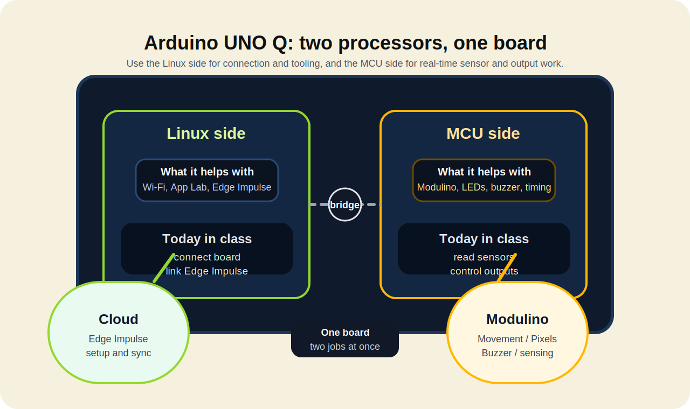
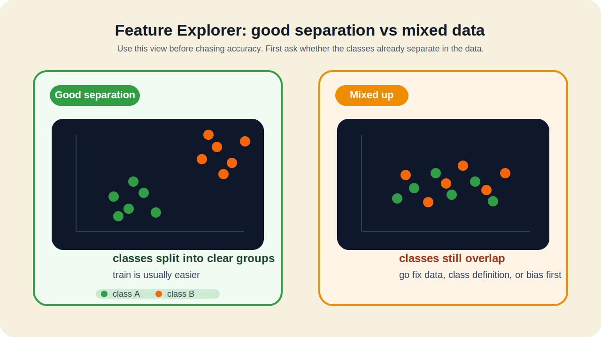

<!-- workshop-header -->


# 🎨 Day 1 Teaching Slides

> 2 deck: **เช้า — คุม UNO Q + input** / **บ่าย — เทรนด้วย Edge Impulse**
> โทน เหลือง/ดำ/ขาว · font Sarabun/Inter · code block พื้นเข้ม · ⭐ = สไลด์หัวใจ ใส่ diagram ช่วย

---

## 📑 Section 1: Opening — 09:00–09:20

**Coding Thailand 2026 — Edge AI Workshop**
*Arduino UNO Q × Modulino × Edge Impulse*


- Mentor: ผศ.ดร.สัญชัย เอียดปราบ
- วิศวกรรมระบบสมองกลฝังตัวและอิเล็กทรอนิกส์สื่อสาร
- คณะวิศวกรรมศาสตร์ มหาวิทยาลัยบูรพา
- วันที่ ____________

---

### Welcome & House Rules

```
Welcome! 🎉

📋 กฎ:
1. มีคำถาม → ยกมือ ไม่ต้องรอ
2. ทำงานเป็นทีม — ไม่ใช่แข่งกันคนเดียว
3. ติดเกิน 5 นาที → บอกพี่เลี้ยง อย่าจมคนเดียว
4. ใช้ AI / เครื่องมือได้ — แต่ต้องอธิบายได้ว่าทำอะไร ทำไม
```

ย้ำกับทีม: วันนี้วัดที่ "ทำเป็น + เล่าได้" ไม่ใช่ "ใครเสร็จก่อน"

---

### งานนี้เดินยังไง

```
ภาพรวม 3 วัน:

Day 1 → สร้างฐานให้แน่น (วันนี้)
        setup, ต่อ input, เก็บ data, train, deploy, test

Day 2 → ต่อยอดเป็น prototype
        ทีมออกแบบ use case เอง เพิ่มความเสถียร

Day 3 → demo + pitch
        เล่าโจทย์ วิธีทำ ผลทดสอบ และข้อจำกัด
```

จบวันนี้ต้องได้ทั้ง **"ของที่รันได้"** และ **"หลักฐานที่เอาไปเล่าต่อได้"** — ทุกทีมเดินเส้นเดียวกัน

---

### ตั้งทีม: ใครทำอะไร (3H) ⭐

```
ทีมนวัตกรรมที่ดี ไม่ใช่ทุกคนทำเรื่องเดียวกัน
แบ่งกัน 3 บทบาท (3H) — คนเดียวถือได้หลายหมวก:

🛠️ Hacker  — ฝั่งเทคนิค: ต่อบอร์ด / เก็บ data / train / deploy
🎨 Hipster — ฝั่งผู้ใช้: output ที่คนเข้าใจ / รูปแบบการใช้งาน / เล่าภาพ
📣 Hustler — ฝั่งคุณค่า: ปัญหาจริงคืออะไร / ใครได้ประโยชน์ / เดโม่เล่ายังไง

เคล็ดลับ: ตกลงบทบาทตั้งแต่ตอนนี้
เวลาติด จะรู้ว่าใครช่วยใครได้
```

ทั้งวันนี้ Hacker จะนำ — แต่ Hipster/Hustler ต้องเก็บข้อมูลไว้เล่าต่อ Day 2 ด้วย

---

# DECK เช้า — "คุม UNO Q ให้อยู่มือ"

### S4 — What is Edge AI?

```
Cloud AI 🌥️        →    Edge AI ⚡
─────────────           ─────────────
ส่งข้อมูลขึ้น cloud         ทำงานบนอุปกรณ์เลย
ช้า ต้องมีเน็ต              เร็ว ไม่ต้องเน็ต
แพงเมื่อ scale            ราคาถูก รันที่เครื่อง
Privacy?                  Privacy ✓ ข้อมูลไม่ออกจากเครื่อง
```

ตัวอย่างใกล้ตัว: Fall detector ผู้สูงอายุ · Smart camera นับคน · ฟังเสียงมอเตอร์เพื่อจับอาการเสีย · คัดของดี/ของเสียในไลน์ผลิต

จุดขายของ Edge AI = **เร็ว + เป็นส่วนตัว + ไม่ต้องพึ่งเน็ต** ซึ่งตรงกับงานที่เราจะทำวันนี้

---

### S5 — ทำไม UNO Q: สองสมอง ⭐

```
UNO Q = สองสมองในบอร์ดเดียว

🧠 MCU side   : real-time I/O — อ่าน sensor / คุม output ทันที (Modulino)
🐧 Linux side : รัน AI ตัวใหญ่ / กล้อง USB / ไมค์ USB / Edge Impulse

→ ต่างจาก Arduino ทั่วไปที่มีแค่ MCU
→ Powered by Qualcomm Dragonwing
→ setup / connect / train ใช้ฝั่ง Linux
→ อ่าน sensor และสั่ง output ทันที ใช้ฝั่ง MCU
```

**จำให้ขึ้นใจ: input คนละแบบเข้าคนละฝั่ง** — บ่ายจะได้ไม่งงว่าทำไม Modulino กับกล้องต่อคนละทาง

<a href="https://www.arduino.cc/product-uno-q/">
        
</a>



---

### S6 — วันนี้จะได้อะไร

```
เช้า — ปูฐานให้แน่น:
✅ บอร์ดเป็นของทีม (ตั้งรหัส / ชื่อ / Wi-Fi เอง)
✅ ต่อ input ครบ 3 แบบ (sensor / กล้อง / ไมค์)

บ่าย — ทำให้เป็น AI จริง:
✅ model V1 + deploy รันบนบอร์ดจริง
✅ Prediction Log อย่างน้อย 10 cases
✅ ส่งงานผ่าน fork พร้อมหลักฐาน
```

ของ 5 ชิ้นนี้คือสิ่งที่ทีมจะถือกลับไปต่อยอดใน Day 2

---

### S7 — ตั้งบอร์ด: ทำไม

```
บอร์ดพวกนี้วนมาจากที่อื่น
รหัส / ชื่อ / Wi-Fi เดิม "ไม่ใช่ของเรา"

=> ตั้งใหม่ให้เป็นของทีม ก่อนเริ่มทำงานจริง
   ไม่งั้นเดี๋ยวงงว่าบอร์ดไหนของใคร เชื่อม Wi-Fi ไม่ได้

⚠️ บอร์ดไม่ boot?
   เช็ก jumper pin ที่เสียบค้างมาก่อน → ถอดออกก่อนเลย
```

Safety key: จ่ายไฟทางเดียว อย่าเสียบไฟซ้อนหลายทาง · จัดสาย Qwiic ไม่ให้ตึง

---

### S8 — ตั้งบอร์ด: ยังไง (ไม่ต้อง flash) ⭐

```
1. เสียบ USB-C → รอ ~30 วิ ให้ Linux boot
2. เปิด Arduino App Lab → login (ของเราเอง)
3. เห็นบอร์ดในรายการ → เข้า Settings:

   • ชื่อบอร์ด        → team-XX-q
   • Change password → ตั้งรหัสทีม (จดไว้! ลืมแล้วยุ่ง)
   • Wi-Fi           → ตั้งให้ตรงกับเครือข่ายของคอม
   • Remote access   → เปิด SSH ไว้

ผ่าน = เห็นชื่อทีม + Wi-Fi ติด + รู้รหัสตัวเอง
```

ไม่ต้อง flash firmware ใหม่ — แค่ตั้งค่าให้เป็นของทีมก็พอ

---

### S9 — Modulino: Plug & Play

```
🔌 Qwiic connector — เสียบแล้วใช้ได้เลย
🚫 ไม่ต้องบัดกรี
🔗 เสียบผิดด้านเข้าไม่ได้ (polarized = ปลอดภัย)

ลำดับการต่อ: sensor ก่อน → output ทีหลัง
   UNO Q → Movement → Pixels → Buzzer
```

<a href="https://store.arduino.cc/pages/modulino">
        
</a>
<a href="https://store.arduino.cc/pages/modulino">
        
</a>

---

### S10–S12 — ต่อ Input 3 แบบ

```
Input 1 — Sensor (Qwiic, ฝั่ง MCU)
   ต่อ Modulino Movement → เปิด sample sketch อ่านค่า
   เช็กผ่าน: ขยับบอร์ดแล้วตัวเลขขยับตาม

Input 2 — Webcam (USB, ฝั่ง Linux)
   เสียบกล้องเข้า powered USB hub → เปิดดูภาพ
   ⚠️ ใช้กล้อง: บอร์ดต้องอยู่บน Wi-Fi — อย่าต่อบอร์ดเข้าคอมพร้อมกัน

Input 3 — Mic (USB, ฝั่ง Linux)
   เสียบ mic เข้า hub → `arecord -l` ต้องเห็นอุปกรณ์
   เช็กผ่าน: พูดแล้ว level ขยับ
```

ย้ำซ้ำ S5: **sensor เข้า MCU / กล้อง+ไมค์ เข้า Linux** — เช็กให้ผ่านทีละตัว อย่าข้าม

---

### S13 — เช้า → บ่าย

```
3 input ที่ต่อได้เมื่อเช้า
บ่ายทีมเลือก "1 อย่าง" ส่งเข้า Edge Impulse

คำถามให้ทีมตัดสินใจ:
อยากสอน AI ให้ "มอง 👁️ / ฟัง 👂 / รู้สึก ✋" อะไร?
```

เลือกจากของที่ทีมต่อแล้วเวิร์กที่สุด ไม่ใช่ของที่ฟังดูเท่ที่สุด

---

# DECK บ่าย — "เทรนจริงด้วย Edge Impulse"

### S14 — Edge Impulse คืออะไร

```
platform เทรน Edge AI ผ่านเว็บ — ฟรี (free tier)

Pipeline 4 ขั้น:
1. 📥 Collect — เก็บข้อมูลจาก input
2. 🏋️ Train   — สอน model
3. 📤 Deploy  — ใส่ลง UNO Q
4. 🧪 Test    — ทดสอบจริง แล้ววนแก้
```

<a href="https://www.edgeimpulse.com/product">
        
</a>

ทำงานทั้งบ่ายให้มองผ่าน 4 ขั้นนี้ — วนกลับไปแก้ data ได้เสมอ ไม่ใช่ทำครั้งเดียวจบ

---

### S15 — Bias: AI จำ shortcut ผิดจุด ⭐

```
Bias แบบง่ายที่สุด:
เราอยากให้ AI จำ "class"
แต่ข้อมูลดันมี "คำใบ้แถม" ปนมา

เก็บจากคนเดียว / ฉากเดียว / ระยะเดียว
=> AI จำ "คนนี้ / ฉากนี้ / ระยะนี้" แทน class จริง
=> พอเปลี่ยนคน เปลี่ยนห้อง เปลี่ยนแสง ก็ทายพัง

เช็กตัวเอง:
"เปลี่ยนคนหรือเปลี่ยนห้องแล้ว ยังทายถูกไหม?"
```


นี่คือกับดักอันดับ 1 ของทีมมือใหม่ — accuracy สวยในห้อง แต่พังทันทีนอกห้อง

---

### S16 — ออกแบบ class

```
ก่อนเก็บข้อมูล ทีมต้องตอบให้ได้:

❓ มีกี่ class?
❓ แต่ละ class ต่างกันด้วยอะไร?
❓ edge case ที่อาจสับสนมีอะไรบ้าง?
❓ เก็บกี่ตัวอย่าง/class? จากใคร ที่ไหนบ้าง?
❓ ตั้งชื่อ label ยังไงให้สะกดตรงกันทุกครั้ง?

→ เขียนลง worksheets/W1-class-design.md
→ ให้เพื่อนหรือทีมข้างๆ ช่วยเช็กก่อนเก็บจริง
```

ออกแบบ class ให้ชัดก่อน = เก็บ data รอบเดียวจบ ไม่ต้องเก็บใหม่

---

### S17 — เชื่อม UNO Q เข้า Edge Impulse ⭐

```
ทางเข้าต่างกันตาม input (ย้อนไป S5: คนละฝั่ง):

📷 กล้อง / 🎤 ไมค์ (ฝั่ง Linux):
   shell → `edge-impulse-linux` → login → เลือก project

✋ Modulino (ฝั่ง MCU):
   ผ่าน App Lab brick หรือ data-forwarder

เห็น data ไหลเข้า Studio ก่อน → ค่อยเริ่มเก็บ dataset
```

<a href="https://docs.edgeimpulse.com/hardware/boards/arduino-uno-q">
        
</a>

ยังไม่เห็น UNO Q ใน Devices = ยังเชื่อมไม่จบ อย่าเพิ่งเก็บ data · คู่มือ: [connect-edge-impulse](https://docs.edgeimpulse.com/hardware/boards/arduino-uno-q)

---

### S18 — เก็บ data ให้ดี

```
เก็บยังไงให้ AI จำถูกเรื่อง (ตรงข้ามกับ S15):

✅ แต่ละ class จำนวนใกล้กัน
✅ สลับคน / มุม / แสง / ระยะ / ความเร็ว
✅ เก็บทั้งเคสง่ายและเคสที่ใกล้ของจริง
✅ ให้คนที่ไม่ได้เก็บ ลองใช้ดูด้วย
✅ ใช้ label เดิม สะกดตรงกันทุก sample
```

จดลง W2 data collection log — เก็บจากใคร ที่ไหน เงื่อนไขอะไร เพื่อเอาไปเล่าและ debug ทีหลัง

---

### S19 — Feature Explorer vs Confusion Matrix

```
Feature Explorer = "ข้อมูลพร้อมไหม" (ดูก่อน train)
   จุดแต่ละ class แยกเป็นก้อน → ดี train ง่าย
   จุดทับกันเยอะ            → data ยังสับสน แก้ก่อน

Confusion Matrix = "โมเดลตอบได้แค่ไหน" (ดูหลัง train)
   เส้นทแยงมุมสูง  → ดี
   นอกเส้นทแยงสูง → class นั้นสับสนกัน แก้ data
```



ถ้าจุดยังปนกันใน Feature Explorer → กลับไปแก้ class/วิธีเก็บ/bias ก่อน อย่ารีบ train รอบใหม่

---

### S20 — Train

```
⚙️ เลือก model ขนาดเล็กสุดที่ลง UNO Q ได้ (ดู option บนจอ)
⚙️ ตั้ง epochs พอประมาณ แล้วดูผล

ดู Confusion Matrix ก่อนดีใจกับ accuracy
   accuracy 95% แต่ off-diagonal สูง = ยังมีปัญหา

memory error? → ลด model size / ลดจำนวน class
accuracy ต่ำ?  → กลับไปดู data ก่อนเพิ่ม epochs
```

accuracy เป็นแค่ตัวเลขเดียว — หลักฐานที่กรรมการ/พี่เลี้ยงเชื่อคือ matrix + การทดสอบจริง

---

### S21 — Deploy ลง UNO Q

```
ใน Edge Impulse:
1. Deployment → "Arduino UNO Q"
2. Build → Download

ใน Arduino App Lab:
3. Import model
4. เลือก input → Run on board

ป้อน input จริง → model ตอบบนบอร์ดได้เลย
```


จำง่าย: **build ใน Edge Impulse → import ใน App Lab → ทดสอบบนบอร์ดจริง**

---

### S22 — ทดสอบ 10 cases

```
ทดสอบอย่างน้อย 10 cases = 5 ปกติ + 5 ท้าทาย

5 ท้าทาย เช่น:
- ก้ำกึ่งระหว่าง class
- เร็ว/ช้าผิดปกติ
- คนใหม่ที่ไม่ได้เก็บ data
- ของที่ใกล้เคียงแต่ไม่ใช่ class จริง

จดลง logs/predictions.csv:
timestamp · input · predicted+confidence · actual · ถูก/ผิด · อาการ
```

วิเคราะห์: เคสไหนผิด? เพราะอะไร? → ถ้าเหลือเวลา เก็บ data เพิ่มในจุดที่พลาด → train V2

---

# DECK ปิดท้าย — "จากของที่รันได้ → ไอเดียนวัตกรรม"

> วันนี้เราได้ "model ที่รันบนบอร์ดได้" แล้ว
> Day 2 ต้องเปลี่ยนมันให้เป็น "นวัตกรรมที่มีคนอยากใช้"
> เริ่มคิดตั้งแต่ตอนนี้ ตอนยังจำสิ่งที่เพิ่งทำได้

---

### S-IDEA1 — หาไอเดีย: เริ่มจาก "ปัญหา" ไม่ใช่ "ของเล่น"

```
กับดักมือใหม่: เริ่มจาก "เรามี sensor อะไร"
ของจริง: เริ่มจาก "ใครเดือดร้อนเรื่องอะไร"

ถามทีมตัวเอง:
- เคยเห็นใคร "ลำบาก / เสียเวลา / พลาด" กับเรื่องอะไร?
- เรื่องนั้นถ้าตรวจจับได้ทันเวลา จะช่วยได้ไหม?
- 3 input ที่เราต่อได้วันนี้ (มอง/ฟัง/รู้สึก) ตอบเรื่องนั้นได้ตัวไหน?

ไอเดียดี = ปัญหาจริง + เราพอทำทัน ไม่ใช่ไอเดียที่ฟังดูเท่ที่สุด
```

ของที่ทีมเพิ่ง train วันนี้ คือ "หลักฐานว่าทำได้จริง" — ต่อยอดจากตรงนั้น ง่ายกว่าเริ่มใหม่

---

### S-IDEA2 — Lean Canvas: เอา 4 ช่องแรกก่อน ⭐

```
ก่อนลงมือทำ prototype ทีมตอบ 4 ช่องนี้ให้ได้ (ตามลำดับ):

1️⃣ Problem        ปัญหาคืออะไร? (2-3 ข้อ) ตอนนี้คนแก้ยังไง?
2️⃣ Customer       ใครคือผู้ใช้จริง? เจาะให้ชัด ไม่ใช่ "ทุกคน"
3️⃣ Value (USP)    "ของเรา ช่วย [ใคร] [ทำอะไร] ต่างจากเดิมเพราะ ___"
4️⃣ Solution       จะแก้ด้วยอะไร? (UNO Q + input ไหน + class อะไร)

ทำแค่ 4 ช่องนี้ให้คมก่อน — ช่องที่เหลือ (revenue, cost ฯลฯ) ไว้ทีหลัง
```

ตัวอย่าง USP: *"SafeFall ช่วยผู้สูงอายุที่อยู่คนเดียว ให้ขอความช่วยเหลือได้ทันเมื่อล้ม — ต่างจาก smartwatch แพงๆ เพราะใช้อุปกรณ์ราคาถึงได้และไม่ต้องต่อเน็ต"*

→ จดลง `worksheets/W4-idea-canvas.md` แล้วให้ทีมข้างๆ ช่วยอ่านว่าเข้าใจไหม

---

### S-IDEA3 — MVP: เล็กแต่พิสูจน์ได้

```
MVP = ฟังก์ชันเดียวที่พิสูจน์ไอเดียได้ ภายในเวลาที่มี

โครงที่ต้องวาดให้ออก:
  Input → AI Model → UNO Q → Prediction → Output ที่คนเห็น

เลือก "1 core function" ที่ต้องสาธิตให้ได้ เช่น:
- ตรวจได้ว่า Safe / Warning
- ได้ยิน Start / Stop แล้วตอบสนอง
- เจอ Anomaly แล้วแจ้งเตือน

คาถา: Build less, prove more — ทำน้อยลง แต่พิสูจน์ให้ชัดขึ้น
```

ฟังก์ชันเดียวที่ทำงานจริง + เล่าได้ ดีกว่าหลายฟังก์ชันที่ทำไม่สุด — นี่คือสิ่งที่ Day 2/3 ใช้ตัดสิน

---

### S23 — ส่งงาน + ปิดวัน

```
🎉 จบ Day 1!

Fork ให้ครบ:
□ hardware-check ผ่าน
□ model V1 deploy ได้จริง
□ predictions.csv ≥10 cases
□ รูป/คลิป model รันบนบอร์ด
□ W4 Idea Canvas — 4 ช่องแรก (Problem/Customer/Value/Solution)
□ ตอบคำถามปิดท้าย 3 ข้อ

โชว์ทีมละ 1–2 นาที:
ปัญหา+ผู้ใช้ / class / V1 ทำได้แค่ไหน / 1 อย่างที่เรียนรู้
```

⏰ Day 2 = เอา Idea Canvas มาต่อยอดเป็น prototype จริง · Day 3 = pitch

---

## 🎨 เอาไปทำสไลด์จริง

- **Theme:** ตามโลโก้ Coding Thailand (เหลือง + ดำ + ขาว)
- **Font:** Sarabun / Inter / Roboto อ่านง่ายระยะไกล
- **Code blocks:** monospace + พื้นหลังสีเข้ม
- **Images:** ภาพ UNO Q / Modulino จริงจาก store.arduino.cc
- **สไลด์ star (⭐ ตั้งทีม 3H, S5, S8, S15, S17, S-IDEA2 Lean Canvas):** ใส่ diagram ช่วยทุกอัน
- **สไลด์เชิงนวัตกรรม (ตั้งทีม + DECK ปิดท้าย):** ไม่ใช่ของแถม — เป็นตัวเชื่อมจาก "ของที่รันได้" ไปสู่ Day 2/3
- ยกไป Canva/Gamma generate ครั้งแรก แล้วปรับ branding ให้ตรง workshop
